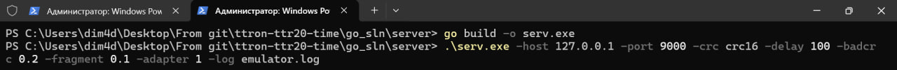
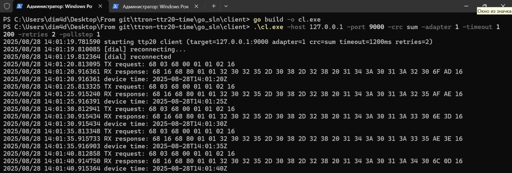
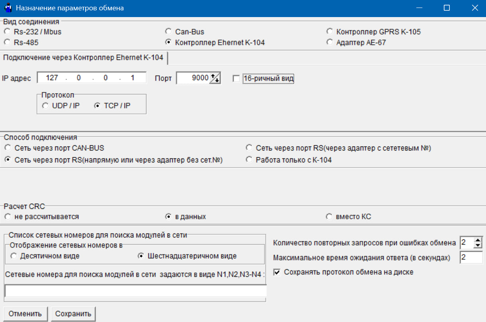

# ttron-ttr20-time


Проект — тестовое задание для **ООО Мависмарт**.
Реализует опросщик (клиент) и эмулятор устройства (server) для тестирования работы с ТТР20 по протоколу FT1.2 и логирования текущего времени.

---

## Содержание

- [Кратко о проекте](#кратко-о-проекте)
- [Структура репозитория](#структура-репозитория)
- [Требования](#требования)
- [Сборка и быстрый запуск](#сборка-и-быстрый-запуск)
  - [Эмулятор (server)](#эмулятор-server)
  - [Клиент (client)](#клиент-client)
- [Флаги и опции](#флаги-и-опции)
- [Формат фрейма (коротко)](#формат-фрейма-коротко)
- [Логи — где они создаются](#логи--где-они-создаются)
- [Отладка / частые проблемы](#отладка--частые-проблемы)
- [Тестовые сценарии и советы](#тестовые-сценарии-и-советы)
- [Полезные ссылки](#полезные-ссылки)
- [Полезные команды (Windows PowerShell)](#полезные-команды-windows-powershell)
- [Python-черновик](#python-черновик)
- [Советы для улучшения/вклад в проект](#советы-для-улучшениявклад-в-проект)
- [Лицензия](#лицензия)

---

## Кратко о проекте

- **Клиент** (`go_sln/client`): подключается по TCP к устройству/эмулятору и каждые ~5 секунд (точнее — в момент кратный 5 секунде) отправляет запрос команды чтения времени (`0x01`). Полученный ответ парсится, время записывается в лог. Поддерживаются два варианта контрольной суммы: `sum` и `crc16`. Реализованы таймауты и retries.
- **Эмулятор** (`go_sln/server`): слушает TCP-порт, отвечает корректными или тестовыми ответами (искусственные задержки, битые CRC, фрагментация). Нужен для тестирования клиента без физического прибора.
- В репозитории также есть вспомогательный **черновик на Python** (`py_sln`).

---

## Структура репозитория

```

.
├── docs/                # Руководства и скриншоты
├── go\_sln/
│   ├── client/          # Клиент (Go)
│   └── server/          # Эмулятор (Go)
├── py\_sln/              # Черновик на Python
├── task/                # Текст задания
├── logs/                # (генерируется автоматически при -log <filename>)
├── .gitignore
└── LICENSE

````

---

## Требования

- Go 1.25
- Тестировалось на Windows 11; код совместим с Linux/macOS (возможно, потребуется скорректировать пути и команды запуска).
- Python 3.x — только для черновиков в `py_sln` (необязательно для основной работы).

---

## Сборка и быстрый запуск

Откройте PowerShell (Windows) или терминал (Linux/macOS) в корне проекта.

### Эмулятор (server)

```powershell
cd go_sln\server
go build -o server.exe
# Пример запуска (Windows PowerShell):
.\server.exe -host 127.0.0.1 -port 9000 -crc sum -delay 100 -badcrc 0.2 -fragment 0.1 -adapter 1 -log emulator.log
````

Параметры в примере:

- `-delay 100` — искусственная задержка ответа в миллисекундах
- `-badcrc 0.2` — 20% шанс отправить некорректный CRC
- `-fragment 0.1` — 10% шанс отправить ответ в 2 фрагмента
- `-adapter 1` — адрес адаптера (0..255)
- `-log emulator.log` — имя файла лога (будет создан `<project_root>/logs/emulator.log`, если указан только имя)

**Пример: сборка и запуск эмулятора (скриншот)**



---

### Клиент (client)

```powershell
cd go_sln\client
go build -o ttp20client.exe
# Пример запуска:
.\ttp20client.exe -host 127.0.0.1 -port 9000 -crc sum -adapter 1 -timeout 1200 -retries 2 -pollstep 1 -log client.log
```

- `-timeout 1200` — таймаут ожидания ответа в мс
- `-retries 2` — число повторных попыток при ошибке
- `-pollstep 1` — тикер (сек) для проверки текущей секунды (обычно 1)
- `-log client.log` — лог клиента (`<project_root>/logs/client.log` если указан только имя)

**Пример: сборка и запуск клиента (скриншот)**



> Linux/macOS: замените обратные слэши на прямые и запускайте соответствующий исполняемый файл (`./server`, `./ttp20client`).

---

## Флаги и опции

### Эмулятор (`server`)

- `-host` — IP для прослушки (по умолчанию `127.0.0.1`)
- `-port` — порт (по умолчанию `9000`)
- `-crc` — `sum` или `crc16`
- `-delay` — искусственная задержка ответа, мс
- `-badcrc` — вероятность (0..1) отправить некорректный CRC
- `-fragment` — вероятность (0..1) отправить ответ в 2 фрагмента
- `-adapter` — адрес адаптера (0..255)
- `-log` — имя файла лога или путь
- `-readtimeout` — таймаут чтения (сек)

### Клиент (`client`)

- `-host` / `-port` — адрес сервера
- `-crc` — `sum` или `crc16`
- `-adapter` — адрес адаптера
- `-timeout` — таймаут ожидания ответа, мс
- `-retries` — число повторных попыток
- `-pollstep` — тикер (сек) для проверки сегмента времени
- `-log` — имя файла лога

---

## Формат фрейма (коротко)

Упрощённый FT1.2-like формат, используемый в проекте:

```
0x68 | LEN | 0x68 | CONTROL | ADDR | DATA... | CHECKSUM | 0x16
```

- `LEN` — длина (CONTROL + ADDR + DATA)
- Пример запроса (sum контрольная сумма):

```
68 03 68 00 01 01 02 16
# где sum = 0x00 + 0x01 + 0x01 = 0x02
```

- Пример ответа (crc16) с ASCII-временем `"2025-08-28 12:36:15"`:

```
68 16 68 80 01 01 32 30 32 35 2D 30 38 2D 32 38 20 31 32 3A 33 36 3A 31 35 <CRC_LO> <CRC_HI> 16
```

**Примечание:** клиент собирает фрейм по байтовому буферу — эмулятор может фрагментировать ответ, поэтому важна корректная сборка по заголовку/длине.

---

## Логи — где они создаются

- Если флаг `-log` задан **и** указано только имя файла (например `-log emulator.log`), лог создаётся в каталоге `<project_root>/logs/` (директория создаётся автоматически).
- Если указан абсолютный путь (`C:\path\mylog.log`), используется указанный путь (и создаются родительские папки при необходимости).
- Если `-log` не задан — вывод идёт в консоль (stdout).

---

## Отладка / частые проблемы

- **Соединение отвергнуто**: проверьте, что эмулятор запущен и слушает порт:

  ```powershell
  netstat -ano | findstr :9000
  ```

- **CRC mismatch**: проверьте совпадение режима `-crc` у клиента и эмулятора.
- **Падения сервера (panic)**: смотрите журнал сервера в `logs/`; в последних версиях добавлен `recover()` внутри обработчика соединения.
- **Фрагментация**: клиент буферизует данные и собирает фрейм по структуре (68…LEN…68).
- **Таймауты**: увеличьте `-timeout` (ms) у клиента или уменьшите `-delay` у эмулятора.
- **Teleport (внешние клиенты)**: для тестирования можно подключать Teleport к эмулятору (`127.0.0.1:9000`) — сравнивайте hex-дампы.

**Пример: настройки подключения в Teleport (скриншот)**



---

## Тестовые сценарии и советы

1. **Sunny path** — запустить `server` и `client` и убедиться, что клиент логирует время каждые \~5 секунд.
2. **Bad CRC** — `server -badcrc 0.2` — клиент должен регистрировать ошибки и делать retries.
3. **Fragmentation** — `server -fragment 0.3` — сервер разобьёт ответы; клиент должен корректно собрать фрейм.
4. **Teleport / сторонние клиенты** — подключите сторонний инструмент к `127.0.0.1:9000` и сравните hex-дампы с логами эмулятора.

---

## Полезные ссылки

Ниже собраны ресурсы, которые помогут понять FT1.2, CRC и работу с сетевыми подключениями в Go/Python.

- [FT1.2 — формат сообщения (PDF)](https://www.dehof.de/eib/pdfs/FT12-Message-Format.pdf) — краткая спецификация/описание формата `0x68 ... 0x16`.
- [Техническая документация ТЭКОН (пример использования FT1.2)](https://kreit.ru/files/tekon-19/t19re_en.pdf) — документ с упоминанием FT1.2 в контексте контроллеров и инструкций.
- [T10 Working Drafts / стандарты (архив черновиков)](https://www.t10.org/drafts.htm) — общие черновики и спецификации по коммуникационным стандартам.
- [TU Wien — KNX/EIB и FT1.2 (статья)](https://www.auto.tuwien.ac.at/~mkoegler/paper/knx05-access) — теоретический и практический контекст.
- [CRC — обзор (Wikipedia)](https://en.wikipedia.org/wiki/Cyclic_redundancy_check) — введение, полиномы, примеры.
- [CRC калькулятор (онлайн)](https://crccalc.com) — быстро проверить значения CRC.
- [Go: `net` — официальная документация](https://pkg.go.dev/net) — работа с TCP, таймауты, Conn.
- [Python `ftplib` — документация](https://docs.python.org/3/library/ftplib.html) — полезно для аналогий в Python-черновике.
- [Поиск на GitHub: crc16 Go примеры](https://github.com/search?q=crc16+go) — готовые реализации и примеры.

---

## Полезные команды (Windows PowerShell)

Проверить порт:

```powershell
Test-NetConnection -ComputerName 127.0.0.1 -Port 9000
```

Смотреть, кто слушает порт:

```powershell
netstat -ano | findstr :9000
Get-Process -Id <PID>
```

Открыть лог в реальном времени:

```powershell
Get-Content .\logs\emulator.log -Tail 200 -Wait
```

---

## Python-черновик

В `py_sln/` лежат простые демо-скрипты клиента и сервера. Полезны для быстрой проверки логики и протокола, но основной рабочий код — в `go_sln`.

---

## Лицензия

MIT © 2025 Dmitry Prikhodko
